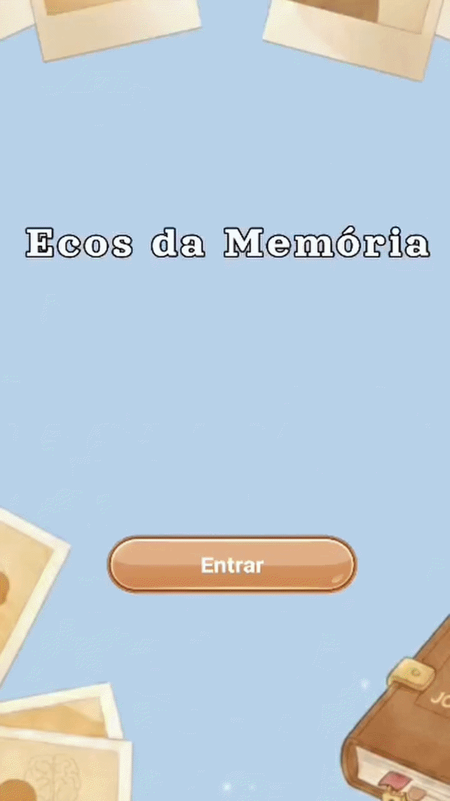

# 🧠 Ecos da Memória — Jogo da Memória

> Plataforma digital de estimulação cognitiva para pacientes com Doença de Alzheimer em estágio leve.
---

## Sobre o Projeto

Ecos da Memória é uma plataforma de serious games desenvolvida para apoiar o treinamento e a manutenção das funções mentais de pessoas com Doença de Alzheimer (DA) em estágio leve. Este repositório contém o primeiro módulo funcional da plataforma: um jogo digital de memória personalizável, que integra exercícios estruturados à terapia de reminiscência.

O projeto foi desenvolvido com a metodologia Design Science Research (DSR), garantindo rigor científico na construção de artefatos tecnológicos voltados para problemas reais.

---

## Sobre o Jogo

O jogo segue a mecânica clássica de correspondência de pares, com o diferencial de utilizar fotografias pessoais e autobiográficas do próprio paciente, como fotos de familiares, objetos e eventos significativos. Isso favorece a evocação de memórias preservadas e aumenta a motivação e adesão terapêutica.

### Objetivos Cognitivos
- Estimular a **memória episódica**
- Fortalecer o **reconhecimento visual**
- Exercitar a **atenção sustentada**


---


# Funcionalidades

- **Imagens personalizáveis** — o paciente ou cuidador insere fotos com valor afetivo e autobiográfico;
- **Níveis de dificuldade adaptáveis** — de 2x2 até 4x3 pares de cartas;
- **Timer e contagem de tentativas** — para acompanhamento do desempenho;
- **Ranking de sessões** — exibe o histórico de partidas com tempo e tentativas, permitindo avaliar a evolução cognitiva ao longo do tempo;
- **Narração por voz** — orienta o jogador com instruções claras, reduzindo a dependência do cuidador e viabilizando o uso por pessoas com dificuldades de leitura;
- **Feedback sonoro imediato** — ao acertar todos os par de cartas;
- **Interface acessível** — projetada seguindo diretrizes de acessibilidade digital para a população idosa.

---

# Arquitetura do projeto

A  plataforma foi estruturada segundo o paradigma modular, no qual cada jogo terapêutico é um componente independente conectado a um núcleo central. Essa organização permite incorporar novos módulos sem alterar a base estrutural do sistema.

```
 Ecos da Memória
 ┣ Módulo: Jogo da Memória   ← (este repositório)
```

O fluxo do sistema é descrito por um diagrama **BPMN** com três lanes principais:

| Lane | Responsabilidade |
|------|-----------------|
| **UI** | Seleção de imagens, configuração do tabuleiro e navegação |
| **Game Core** | Gerenciamento da partida e lógica de verificação de pares |
| **Ranking/Dados** | Persistência de pontuações via `PlayerPrefs` |

---

## Tecnologias

| Tecnologia | Uso |
|------------|-----|
| [Unity](https://unity.com/) | Engine de desenvolvimento do jogo |
| C# | Linguagem de programação |
| Android | Plataforma de execução |
| BPMN | Modelagem da arquitetura do sistema |

---

# Instalação

### Pré-requisitos
- [Unity Hub](https://unity.com/download) instalado
- Unity versão **2021.3 LTS** ou superior

### Passos

```bash
# Clone o repositório
git clone https://github.com/AnaCarolinaxc/Ecos-da-memoria.git

# Acesse a branch do projeto
git checkout version/SBCAS
```

1. Abra o **Unity Hub**
2. Clique em **Add project from disk** e selecione a pasta clonada
3. Abra o projeto e aguarde a importação dos assets
4. Abra a cena Main em `Assets/Scenes/`
5. Pressione **Play** para iniciar

---

## Como Jogar

1. **Tela inicial** — clique em **Jogar** para iniciar ou **Ranking** para ver o histórico
2. **Preparação** — escolha o tamanho do tabuleiro (2x2, 3x2, 4x2 ou 4x3) e adicione suas fotos clicando em **Adicionar Imagens**
3. **Clique em Iniciar Jogo** — as cartas serão embaralhadas e viradas para baixo
4. **Durante a partida** — vire duas cartas por vez; se forem iguais, o par é encontrado!
5. **Fim de jogo** — ao encontrar todos os pares, o ranking é exibido com seu tempo e número de tentativas

---

# Demonstração da Execução

Abaixo está um exemplo de execução do jogo **Ecos da Memória**.

<p align="center">
  
</p>
